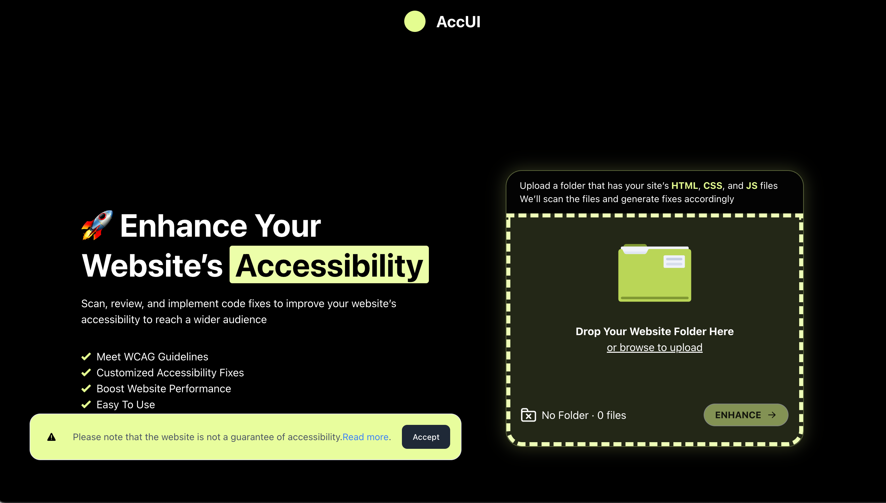

# `accessible-ui-helper`
Repository for the Accessible UI (AccUI) Helper Project - [CSCI2340](https://sites.google.com/brown.edu/csci2340/home) Software Engineering Course.

Our web application allows for developers to check their website's accessibility as they develop, and generates automated fixes for any accessibility violation the user wants to correct. For more information about the accessibility guidelines we follow, you can refer to the [W3C Accessibility Standards](https://www.w3.org/WAI/standards-guidelines/) page.



## 💻⚙️ Tech Stack
- Front-End: React.js
- Back-End: Express
- Language: TypeScript
- Delivery: Docker and Nginx

## ✅ Pre-requisites
- Node.js (`v16` and up)
- React.js
- OpenAI API key. Add a `.env` file to the root of `accessible-ui-helper/backend/`, and inside the file add `GPT_API_TOKEN=<yourOpenAiApiKey>`. For more info on OpenAI API keys, check the [OpenAI website](https://openai.com/index/openai-api/).
- Docker (if running via containers using `docker-compose`)

## 🗂️ Folder structure
```
.
├── .github                  # Old unused code
├── backend                  # Contains back-end code
│   ├── ...                 
│   └── Dockerfile                                
├── frontend                 # Contains front-end code
│   ├── ...                 
│   └── Dockerfile                                  
├── nginx
│   ├── default.conf         # Nginx config
│   └── Dockerfile
├── status                   # Contains status.md files for each contributor
│   └── ...                
├── .gitignore
├── code_style.md
├── docker-compose.yml       # Configuration to build and run nginx, frontend, and backend containers   
├── package-lock.json             
├── package.json                   
├── LICENSE
├── README.md
└── ...                      # Transpiler config, homepage image
```

## 🛠️ Installation

To run this application locally, follow the installation instructions in the [frontend README](./frontend/README.md), as well as the [backend README](./backend/README.md) files.

## 💻 Usage

### Local run

If running locally, run the following commands in different terminal windows to start the front-end and back-end
```bash
npm start # front-end

npm run dev # back-end with hot reload
```
### Running with Docker
If running the application on docker, please make sure the docker daemon is running (you can check docker desktop if on a Mac or Windows PC).
Then run
```bash
docker-compose up --build
```

## 👥 AccUI Team

Front-End
- [Marie Baker](https://github.com/)
- [Yongcheng Shi](https://github.com/)
- [Stephanie Olaiya](https://github.com/)
- [Jiecheng Chen](https://github.com/)
- [Brandon Woodard](https://github.com/)

Back-End
- [Sybille Légitime](https://github.com/)
- [Rio Young](https://github.com/)
- [Ruoqian Zhang](https://github.com/)
- [Zheng Que](https://github.com/)

## License

[MIT License](https://choosealicense.com/licenses/mit/)
